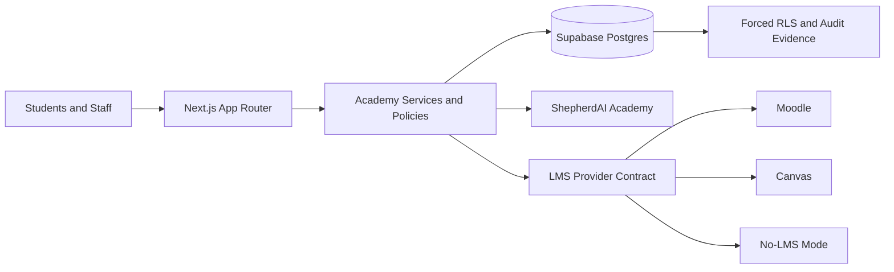

<div align="center">
  

  # ChurchCore Academy

  **A multi-tenant education management and student information platform for faith-based institutions.**

  Bible schools, ministry institutes, children's schools, seminaries, colleges, universities, and mixed-mode academies can share one configurable academic core without making an LMS the system of record.

  [](#project-status)
  [](https://github.com/ricardojjulia/ChurchCore-Academy/actions/workflows/ci.yml)
  [](LICENSE)
  [](https://nextjs.org/)
  [](https://react.dev/)
  [](https://www.typescriptlang.org/)
  [](https://supabase.com/)
</div>

> [!IMPORTANT]
> ChurchCore Academy is a controlled-pilot candidate for core SIS workflows after Council Review IX. The release decision is split: core SIS pilot is allowed with provider activation disabled, while general availability, live payment/email/SMS/LMS providers, regulated aid, and broad production official-record use remain gated.

## Why ChurchCore Academy

Most education systems assume either a conventional K-12 school or a standard university. Faith-based institutions often combine certificate programs, ministry formation, children's education, continuing education, seminaries, and degree-bearing programs under one organization.

ChurchCore Academy is designed around that variability:

- configurable institution modes, calendars, subdivisions, credits, clock hours, and grading
- tenant-scoped people, roles, guardians, faculty, students, and academic records
- provider-neutral LMS integration for Moodle, Canvas, or no-LMS operation
- a first-class Student PWA rather than an LMS wrapper
- deterministic, human-reviewed academic workflow recommendations through ShepherdAI Academy
- governed learner intelligence with explicit learner consent and database-enforced isolation

## Project Status

| Area | Status | Notes |
| --- | --- | --- |
| Institution configuration | Foundation + seed data | Configurable institution modes and operating rules; demo institution seeded |
| Academic calendars and subdivisions | Foundation + seed data | Bible School, Children's School, College calendars seeded with real periods |
| Course catalog and sections | Foundation + seed data | 7 courses and 6 sections across all institution modes seeded |
| People, roles, guardians, and faculty | Foundation + seed data | 12 people with profiles, roles, and student relationships seeded |
| Academic programs (normalized) | New in 0.2.0 | `academy_academic_programs` — UUID-PK, multi-mode, full CRUD API |
| Academy dataset wiring | New in 0.3.0 | `AcademyDataRepository` queries real normalized tables; all admin and faculty screens unblocked |
| Course catalog admin screen | New in 0.4.0 | `/admin/courses` — courses table + sections table with period name resolution and instructor lookup |
| Attendance screens | Updated in 0.4.0 | Real section IDs and student names replace hardcoded demo data in admin and faculty attendance |
| Graduation audit screen | New in 0.5.0 | `/admin/graduation` — credit readiness, holds, and registrar review triage with threshold from dataset |
| ShepherdAI workflow signals | Fixed in 0.5.0 | Workflows page now derives tenant ID from verified session instead of an unsecured request header |
| Tenant identity wiring | Fixed in 0.7.0 | Developer account linked to `cca-main`; enrollment seed applied; migration runner tracks applied migrations |
| Grading and transcript rules | Foundation + seed data | Evaluation scales, gradebook scales, sample submissions and records seeded |
| Authentication and tenant isolation | Release 1 exit gate closed | Verified Supabase sessions, request-scoped database context, forced RLS, no runtime seeded-data fallback |
| Admissions | Working vertical slice | Application, submission, review, decision, audit, and conversion; demo chains seeded |
| Student enrollment | Foundation + seed data | Full program enrollment, period registration, and section registration chains seeded |
| Student PWA | Workflow surface | Courses, schedule, progress, documents/transcript request, account, aid, messages, LMS launch, attendance, and privacy controls are wired to governed routes/read models |
| LMS integrations | Executable worker boundary | Moodle/Canvas normalized operations, reviewed imports, retry/idempotency handling; live provider HTTP clients remain activation work |
| ShepherdAI Academy | Deterministic foundation | Human-reviewed academic workflow recommendations only |
| Living Learner Intelligence System | Governed foundation | Consent lifecycle and immutable evidence ledger implemented |
| Billing, aid, reporting, communications | Working foundations | Production provider activation and operations hardening remain |
| Competitive readiness | Controlled-pilot candidate | ADR-0038 role matrix, migration rehearsal, deployment runbooks, provider activation checklist, and final council closeout are complete; live providers remain gated |

See [Project Status](docs/project-status.md), [Council Review IX](docs/reviews/2026-06-21-council-review-9-release-closeout.md), and the [Factory Roadmap](docs/product/factory-roadmap.md) for the detailed delivery position.

## Product Boundary

ChurchCore Academy owns the SIS and academic administration layer:

- admissions, enrollment, registration, records, grading, transcripts, and graduation
- institution configuration, calendars, programs, courses, sections, people, and permissions
- student, guardian, faculty, advisor, registrar, and administrator workflows
- provider-neutral LMS launch, synchronization contracts, audits, and reconciliation

It does **not** own Moodle or Canvas runtime behavior, course-content delivery, LMS plugins, themes, or provider internals. An LMS may deliver learning; Academy remains the academic system of record.

## Architecture



Core architectural rules:

1. Supabase verifies the external session.
2. Persisted account links and active role assignments establish Academy identity.
3. Request transactions set tenant and person context for PostgreSQL RLS.
4. Caller-supplied headers and editable JWT metadata never grant production authority.
5. Official academic records remain inside Academy.
6. LMS behavior stays behind provider-neutral contracts.
7. AI-assisted workflows are explainable, scoped, and human-reviewed.

Read [Architecture](docs/architecture.md), [Technology](docs/technology.md), and the [Architecture Decision Records](docs/adr/README.md).

## Technology

| Layer | Technology |
| --- | --- |
| Web application | Next.js 16 App Router, React 19, TypeScript 6 |
| UI | Custom React components, Radix primitives, Tailwind/CSS utilities, Lucide icons |
| Data and identity | Supabase Auth, PostgreSQL, Row Level Security |
| Database access | `pg`, request-scoped transactions, SQL migrations |
| Testing | Node test runner with `tsx` |
| Quality | ESLint 9, Next.js production builds, database role-matrix verification |
| Deployment target | Vercel-compatible Next.js runtime and Supabase |
| Integrations | Provider-neutral LMS contract, Moodle, Canvas, no-LMS mode |

## Getting Started

### Prerequisites

- Node.js 24 or newer
- npm 11 or newer
- Docker-compatible runtime for local Supabase
- [Supabase CLI](https://supabase.com/docs/guides/local-development/cli/getting-started)

### Installation

```bash
git clone https://github.com/ricardojjulia/ChurchCore-Academy.git
cd ChurchCore-Academy
npm install
cp .env.example .env.local
supabase start
npm run db:migrate:local
npm run db:seed:local
npm run dev
```

Open [http://localhost:3000](http://localhost:3000).

Protected pages fail closed without a valid Supabase session and matching Academy identity records. Local header bootstrap is disabled unless explicitly enabled and is never allowed in production.

### Environment

`.env.example` documents the supported local variables. At minimum, configure:

```dotenv
NEXT_PUBLIC_SUPABASE_URL=
NEXT_PUBLIC_SUPABASE_PUBLISHABLE_KEY=
SUPABASE_SERVICE_ROLE_KEY=
DATABASE_URL=
```

Never expose `SUPABASE_SERVICE_ROLE_KEY` to browser code or commit populated environment files.

## Commands

| Command | Purpose |
| --- | --- |
| `npm run dev` | Start the development server |
| `npm run build` | Create a production build and run TypeScript checks |
| `npm run start` | Start the production server |
| `npm run lint` | Run repository linting |
| `npm test` | Run the complete automated test suite |
| `npm run db:migrate:local` | Apply ordered SQL migrations to local Postgres |
| `npm run db:seed:local` | Seed local Academy data |
| `npm run verify:migration-seed-rehearsal` | Verify migration tracking, deterministic seed counts, and runtime source boundary |
| `npm run verify:role-walkthrough` | Generate authenticated role walkthrough evidence from the ADR-0038 role matrix |
| `npm run verify:admissions-rls` | Verify the admissions database role matrix |
| `npm run verify:enrollment-conversion-rls` | Verify enrollment-conversion isolation |
| `npm run verify:llis-consent-rls` | Verify LLIS consent and evidence isolation |

## Repository Layout

```text
src/app/                 Next.js pages, layouts, and API routes
src/components/          Shared UI and Student PWA components
src/modules/             Domain modules, policies, services, repositories, tests
src/lib/                 Database, Supabase, migration, and runtime utilities
supabase/migrations/     Ordered PostgreSQL schema and RLS migrations
scripts/                 Local database and live role-matrix verification
docs/adr/                Architecture decision records
docs/product/            Product strategy and factory roadmap
docs/runbooks/           Operational procedures
docs/superpowers/        Approved design specs and implementation plans
```

## Documentation

- [Documentation Index](docs/README.md)
- [Architecture Boundary](docs/architecture.md)
- [Technology Overview](docs/technology.md)
- [Project Status](docs/project-status.md)
- [Product Master Plan](docs/product/faith-based-academy-master-plan.md)
- [Factory Roadmap](docs/product/factory-roadmap.md)
- [Software Factory](docs/software-factory.md)
- [LMS Provider Strategy](docs/lms-dual-provider-strategy.md)
- [ShepherdAI Academy](docs/shepherd-ai-academy.md)
- [Authentication and Tenant Runbook](docs/runbooks/academy-auth-and-tenant-access.md)
- [Authenticated Role Walkthrough Evidence](docs/acceptance/authenticated-role-walkthrough-evidence.md)
- [Deployment Operations Runbook](docs/runbooks/deployment-operations.md)
- [Observability Runbook](docs/runbooks/observability.md)
- [Provider Activation Runbook](docs/runbooks/provider-activation.md)

## Contributing

Review [CONTRIBUTING.md](CONTRIBUTING.md), [SECURITY.md](SECURITY.md), and the [Code of Conduct](CODE_OF_CONDUCT.md) before opening a pull request. Changes that affect identity, tenant isolation, student records, transcripts, LMS synchronization, ShepherdAI, or learner intelligence require focused security and data-boundary verification.

## License

ChurchCore Academy is open source under the [GNU Affero General Public License v3.0](LICENSE).
