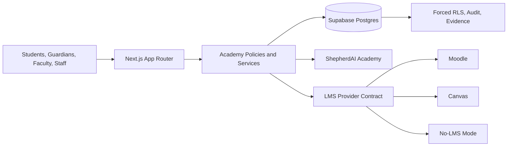

<div align="center">
  

  # ChurchCore Academy

  **A multi-tenant education management and student information platform for faith-based institutions.**

  Bible schools, ministry institutes, children's schools, seminaries, colleges, universities, and mixed-mode academies can run admissions, enrollment, records, billing foundations, student self-service, and LMS integration from one governed academic core.

  [](#project-status)
  [](https://github.com/ricardojjulia/ChurchCore-Academy/actions/workflows/ci.yml)
  [](LICENSE)
  [](https://nextjs.org/)
  [](https://react.dev/)
  [](https://www.typescriptlang.org/)
  [](https://supabase.com/)
</div>

> [!IMPORTANT]
> Current version: `0.9.0`. ChurchCore Academy is a controlled-pilot candidate for core SIS workflows. Institution capability flags are now enforced at the API layer — mode-pack configuration has runtime effect. The codebase has the Academy-owned implementation for Moodle and Canvas integration, but production provider activation remains an external release gate requiring sandbox evidence, tenant approval, rollback review, and provider owner signoff.

## What This Software Does

ChurchCore Academy is the SIS and education operations layer for faith-based institutions that do not fit neatly into one conventional K-12, university, seminary, or LMS-first model. It keeps Academy as the system of record while allowing Moodle, Canvas, or no-LMS operation behind provider-neutral contracts.

The product currently covers:

- institution setup, calendars, subdivisions, courses, sections, grading, transcript rules, and program structures;
- verified-session identity, tenant-scoped roles, forced PostgreSQL RLS, immutable audit evidence, and seeded-runtime-data removal;
- admissions application, document checklist, staff review, decision, and accepted-application conversion into student/enrollment records;
- course-section registration, attendance, grade posting, transcript request/issuance, billing ledger, financial-aid foundation, reporting exports, communications, and Student PWA workflows;
- faculty, guardian, student, platform-admin, admissions, registrar, finance, and institution-admin surfaces;
- ShepherdAI Academy deterministic workflow suggestions with human review;
- Living Learner Intelligence consent and evidence foundations;
- Moodle and Canvas integration implementation through activation boundary, live transport helpers, durable worker queue, idempotency, reviewed imports, reconciliation parity, and LMS readiness UI.

## Project Status

| Area | Status | Current Position |
| --- | --- | --- |
| Core SIS workflows | Controlled-pilot candidate | Admissions, conversion, registration, attendance, grade posting, transcripts, billing ledger, reporting, communications, and Student PWA workflows are implemented with tests and runbooks. |
| Authentication and tenant isolation | Release gate closed | Supabase session identity, Academy account links, role assignments, request-scoped database context, forced RLS, and audit evidence are implemented. |
| Student PWA | Working workflow surface | Courses, schedule, progress, documents/transcript request, account, aid, messages, LMS launch, attendance, offline shell, and privacy controls are present. |
| Admin/faculty/guardian/platform surfaces | Working pilot surfaces | Dashboard, admissions, students, programs, courses, sections, attendance, gradebook, billing, financial aid, reporting, communications, workflows, guardian, and platform control surfaces exist. |
| LMS integrations | Code-complete for Academy-owned MVP closeout | Moodle and Canvas have provider config/secret boundaries, HTTP clients, worker execution, Student PWA launch, reviewed imports, reconciliation, readiness UI, and runbooks. Production activation is gated by external sandbox evidence. |
| Payments and communications providers | Boundaries implemented | Stripe/email provider boundaries and queues exist, but live production activation requires provider-specific evidence and approvals. |
| Regulated/federal aid | External compliance gate | Institutional aid foundation exists; regulated aid requires separate compliance validation before activation. |
| ShepherdAI / LLIS | Governed foundation | Deterministic, human-reviewed workflow recommendations and learner consent/evidence foundations are implemented. Model-generated prediction and autonomous intervention require separate governance approval. |
| General availability | Not approved | The software is not approved for unrestricted production official-record use or broad GA claims. |

Authoritative status docs:

- [Project Status](docs/project-status.md)
- [Factory Roadmap](docs/product/factory-roadmap.md)
- [Controlled Pilot Release Notes](docs/releases/2026-06-21-controlled-pilot-release-notes.md)
- [Full LMS Integration Readiness](docs/releases/2026-06-26-full-lms-integration-readiness.md)
- [Council Review XII LMS Closeout](docs/reviews/2026-06-26-council-review-12-full-lms-integration-mvp.md)

## Product Boundary

ChurchCore Academy owns the academic system of record:

- admissions, enrollment, registration, attendance, grades, transcripts, holds, aid foundations, billing ledger, communications, reporting, and student self-service;
- institution configuration, calendars, programs, courses, sections, people, guardians, staff, roles, and permissions;
- provider-neutral LMS launch, synchronization contracts, worker jobs, reviewed imports, audit events, and reconciliation;
- explainable ShepherdAI workflow recommendations and LLIS consent/evidence storage.

ChurchCore Academy does not own Moodle or Canvas runtime internals, course content authoring, LMS plugins, LMS themes, provider account administration, provider credential issuance, or provider production environments. Moodle and Canvas can deliver learning, but Academy remains the academic record authority.

## Architecture



Core architectural rules:

1. Supabase verifies the external session.
2. Academy account links and active role assignments establish tenant/person authority.
3. Request transactions set tenant and person context for PostgreSQL RLS.
4. Caller-supplied headers and editable JWT metadata never grant production authority.
5. Official academic records remain inside Academy.
6. LMS behavior stays behind provider-neutral contracts.
7. Provider secrets never enter browser responses, Student PWA models, audit metadata, official records, ShepherdAI inputs, or ordinary domain tables.
8. AI-assisted workflows remain explainable, scoped, consent-aware, and human-reviewed.

## Technology

| Layer | Technology |
| --- | --- |
| Web application | Next.js 16 App Router, React 19, TypeScript 6 |
| UI | Custom React components, Radix primitives, Tailwind/CSS utilities, Lucide icons |
| Data and identity | Supabase Auth, PostgreSQL, Row Level Security |
| Database access | `pg`, request-scoped transactions, SQL migrations |
| Testing | Node test runner with `tsx` |
| Quality | ESLint 9, Next.js production builds, migration/seed and role-matrix verification |
| Deployment target | Vercel-compatible Next.js runtime and Supabase |
| Integrations | Provider-neutral LMS contract, Moodle, Canvas, no-LMS mode, Stripe boundary, Resend/email boundary |

## Getting Started

### Prerequisites

- Node.js 24 or newer
- npm 11 or newer
- Docker-compatible runtime for local Supabase
- Supabase CLI

### Local Setup

```bash
git clone https://github.com/ricardojjulia/ChurchCore-Academy.git
cd ChurchCore-Academy
npm install
cp .env.example .env.local
supabase start
npm run db:migrate:local
npm run db:seed:local
npm run dev
```

Open [http://localhost:3200](http://localhost:3200).

Protected pages fail closed without a valid Supabase session and matching Academy identity records. Local header bootstrap is disabled unless explicitly enabled and is never allowed in production.

### Required Environment Variables

`.env.example` documents the supported local variables. At minimum, configure:

```dotenv
NEXT_PUBLIC_SUPABASE_URL=
NEXT_PUBLIC_SUPABASE_PUBLISHABLE_KEY=
SUPABASE_SERVICE_ROLE_KEY=
DATABASE_URL=
```

Never expose `SUPABASE_SERVICE_ROLE_KEY`, provider tokens, payment secrets, LMS credentials, webhook signatures, or raw provider payloads to browser code or committed files.

## Commands

| Command | Purpose |
| --- | --- |
| `npm run dev` | Start the development server on port 3200 |
| `npm run build` | Create a production build and run TypeScript checks |
| `npm run start` | Start the production server on port 3200 |
| `npm run lint` | Run repository linting |
| `npm test` | Run the complete automated test suite |
| `npm run db:migrate:local` | Apply ordered SQL migrations to local Postgres |
| `npm run db:seed:local` | Seed local Academy data |
| `npm run verify:migration-seed-rehearsal` | Verify migration tracking, deterministic seed counts, and runtime source boundary |
| `npm run verify:role-walkthrough` | Generate authenticated role walkthrough evidence from the ADR-0038 role matrix |
| `npm run verify:admissions-rls` | Verify admissions database isolation |
| `npm run verify:enrollment-conversion-rls` | Verify enrollment-conversion isolation |
| `npm run verify:llis-consent-rls` | Verify LLIS consent and evidence isolation |

## High-Value Routes

| Route | Purpose |
| --- | --- |
| `/admin` | Institution admin dashboard and operational navigation |
| `/admin/admissions` | Admissions staff review and conversion workflows |
| `/admin/students` | Student records and student profile access |
| `/admin/courses` | Course catalog and section administration |
| `/admin/gradebook` | Registrar/admin gradebook overview |
| `/admin/transcripts` | Transcript request, issue, hold, release, revoke workflows |
| `/admin/billing` | Billing ledger and account workflows |
| `/admin/reporting` | Reporting and export foundation |
| `/admin/settings/lms` | Moodle/Canvas readiness, circuit, validation, and evidence status |
| `/faculty` | Faculty operational dashboard |
| `/guardian` | Guardian portal shell and scoped student access |
| `/student` | Student PWA dashboard and self-service routes |
| `/platform/control` | Platform tenant control plane |
| `/apply` | Public applicant entry point |

## Repository Layout

```text
src/app/                 Next.js pages, layouts, and API routes
src/components/          Shared UI and Student PWA components
src/modules/             Domain modules, policies, services, repositories, tests
src/lib/                 Database, Supabase, migration, and runtime utilities
supabase/migrations/     Ordered PostgreSQL schema and RLS migrations
scripts/                 Local database and role/tenant verification scripts
docs/adr/                Architecture decision records
docs/product/            Product strategy and factory roadmap
docs/runbooks/           Operational procedures
docs/releases/           Release notes and readiness packages
docs/reviews/            Council reviews and closeouts
docs/superpowers/        Approved design specs and implementation plans
```

## Documentation

- [HOWTO](HOWTO.md)
- [CHANGELOG](CHANGELOG.md)
- [Versioning](VERSIONING.md)
- [Documentation Index](docs/README.md)
- [Architecture Boundary](docs/architecture.md)
- [Technology Overview](docs/technology.md)
- [Project Status](docs/project-status.md)
- [Product Master Plan](docs/product/faith-based-academy-master-plan.md)
- [Factory Roadmap](docs/product/factory-roadmap.md)
- [Software Factory](docs/software-factory.md)
- [LMS Provider Strategy](docs/lms-dual-provider-strategy.md)
- [ShepherdAI Academy](docs/shepherd-ai-academy.md)
- [Authentication and Tenant Runbook](docs/runbooks/academy-auth-and-tenant-access.md)
- [Authenticated Role Walkthrough Evidence](docs/acceptance/authenticated-role-walkthrough-evidence.md)
- [Deployment Operations Runbook](docs/runbooks/deployment-operations.md)
- [Observability Runbook](docs/runbooks/observability.md)
- [Provider Activation Runbook](docs/runbooks/provider-activation.md)

## Audit And Release Gates

The standard repository clean gate is:

```bash
npm test
npm run lint
npm run build
git diff --check
```

For release-sensitive work, add the relevant focused checks:

```bash
npm run verify:migration-seed-rehearsal
npm run verify:role-walkthrough
npm run verify:admissions-rls
npm run verify:enrollment-conversion-rls
npm run verify:llis-consent-rls
```

Production activation of payment, email/SMS, Moodle, Canvas, or regulated-aid workflows requires the provider-specific runbook evidence. Code-complete does not mean provider-activated.

## Contributing

Review [CONTRIBUTING.md](CONTRIBUTING.md), [SECURITY.md](SECURITY.md), and the [Code of Conduct](CODE_OF_CONDUCT.md) before opening a pull request. Changes that affect identity, tenant isolation, student records, transcripts, billing, LMS synchronization, ShepherdAI, LLIS, provider activation, or regulatory boundaries require focused security and data-boundary verification.

## License

ChurchCore Academy is open source under the [GNU Affero General Public License v3.0](LICENSE).
