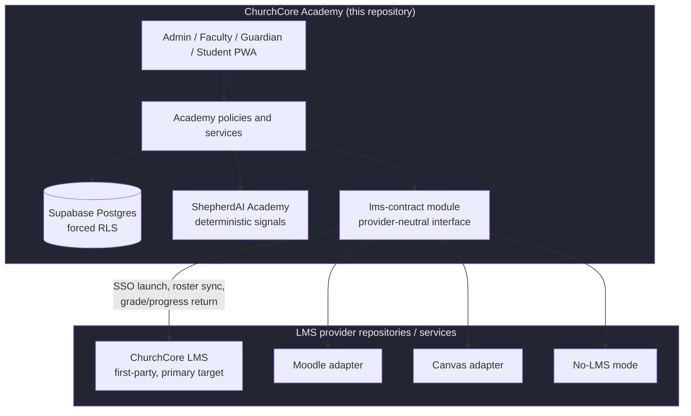
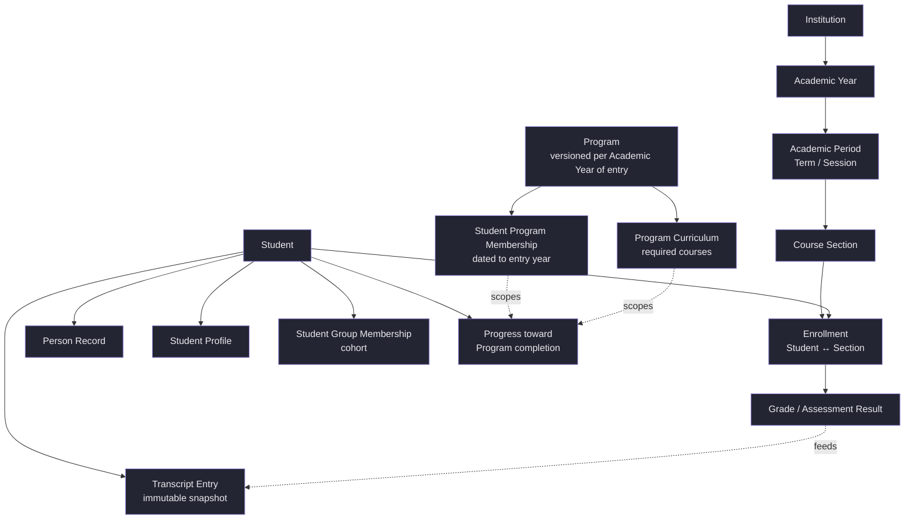
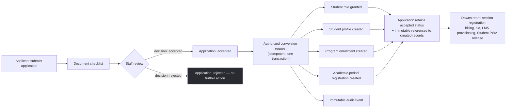

# ChurchCore Academy Architecture Boundary

## System boundary at a glance



Academy is the system of record. LMS providers deliver instruction. The `lms-contract` module is the only place that boundary is allowed to be crossed — no LMS runtime code lives in this repository, and no SIS business logic lives in an LMS-specific code path.

## Repositories

### ChurchCore Academy repository

Owns:

- faith-based SIS and education-management workflows
- Bible school, children's school, seminary, college, and university configuration
- students, guardians, faculty, teachers, professors, administrators, academic records, and permissions
- academic years, terms, sessions, cohorts, campuses, departments, divisions, calendars, course catalogs, sections, grading models, transcripts, and student PWA workflows
- admissions, enrollment, transcript, grading, graduation, and compliance operations
- dashboards, reporting, and academic-administrative workflows
- LMS launch orchestration from the Academy side

Does not own:

- Moodle runtime
- Moodle themes or plugins
- Canvas runtime internals
- LMS course delivery behavior

### LMS provider repositories or services

Owns:

- Moodle or Canvas runtime maintenance
- LMS themes, plugins, extensions, or provider-specific deployment assets
- LMS course delivery experience
- course delivery and learning runtime concerns
- Academy-driven launch and sync endpoints exposed inside the provider

## Integration contract

Keep the cross-system boundary narrow and explicit:

- identity handoff
- tenant and campus context
- enrollment sync
- roster sync
- grade/progress return path
- logout coordination
- audit logging across systems
- provider capability reporting
- reconciliation jobs and idempotent retries

## Architectural rule

If a feature still makes sense when Moodle is removed, it belongs in the ChurchCore Academy repository.

If a feature only exists because Moodle or Canvas behaves a certain way, it belongs in an LMS provider adapter or provider repository, not in Academy domain logic.

## Production security boundary

```mermaid
sequenceDiagram
    participant Browser
    participant NextJS as Next.js Server Component / Route
    participant Supabase as Supabase auth.getUser()
    participant Links as academy_account_links + roles
    participant TX as withAcademyDatabaseContext
    participant PG as Postgres (forced RLS)

    Browser->>NextJS: Request (cookies only — no trusted headers)
    NextJS->>Supabase: Verify session
    Supabase-->>NextJS: Verified user or reject
    NextJS->>Links: Resolve tenant + person + active roles
    Links-->>NextJS: Actor context (tenantId, personId, roles)
    NextJS->>TX: Open request-scoped transaction, set tenant/person context
    TX->>PG: Query/mutate (RLS enforces tenant + role on every row)
    PG-->>TX: Rows scoped to actor's tenant only
    TX-->>NextJS: Result
    NextJS-->>Browser: Response (no provider secrets, no seeded data)
```

- Supabase `auth.getUser()` verifies the external session.
- Active `academy_account_links` and role assignments resolve Academy person, tenant, and authority.
- Request headers never grant production identity or roles.
- Every Academy-owned table enables and forces RLS through the Release 1 and domain migrations.
- Protected server pages execute dataset reads inside `withAcademyDatabaseContext`.
- Seeded Academy records are prohibited from runtime UI modules.
- Audit records are append-only and reject secret-shaped metadata.

Request-facing reads and workflow mutations share verified request-scoped RLS transactions. The Release 1 security exit gate is closed for the verified-session, request-scoped RLS, immutable audit, and seeded-runtime-data foundation. Later workflow releases still require their own browser role-matrix and live policy acceptance before production use.

## Core Academic Loop data model

The canonical entity graph every module ultimately hangs off of — see `docs/product/product-context.md` for the full narrative and the step-by-step loop this supports:



The write path targets this normalized core directly. Student-facing views, LMS roster feeds, progress dashboards, and transcript documents are read-only projections — never the authoritative write target.

## Admissions boundary

- Admission applications are pre-student records, not student profiles or enrollments.
- Applicant, program, term, deciding staff, and event references are constrained by tenant-aware composite foreign keys.
- Applicants require an active `applicant` role and may access only their own application.
- Authorized same-tenant staff may review and decide applications.
- Every mutation is idempotent and writes immutable application and global audit events.
- Acceptance has no automatic SIS or LMS side effects.
- An authorized conversion request creates the student role, student profile, program enrollment, and academic-period registration in one request-owned transaction.
- Conversion retains the applicant role and leaves the application in the accepted state with immutable references to the created records.
- Student numbers are allocated per tenant under a row lock; idempotency and unique application constraints prevent duplicate conversion.
- Course-section registration, billing, financial aid, LMS provisioning, and Student PWA record release remain downstream workflows.


